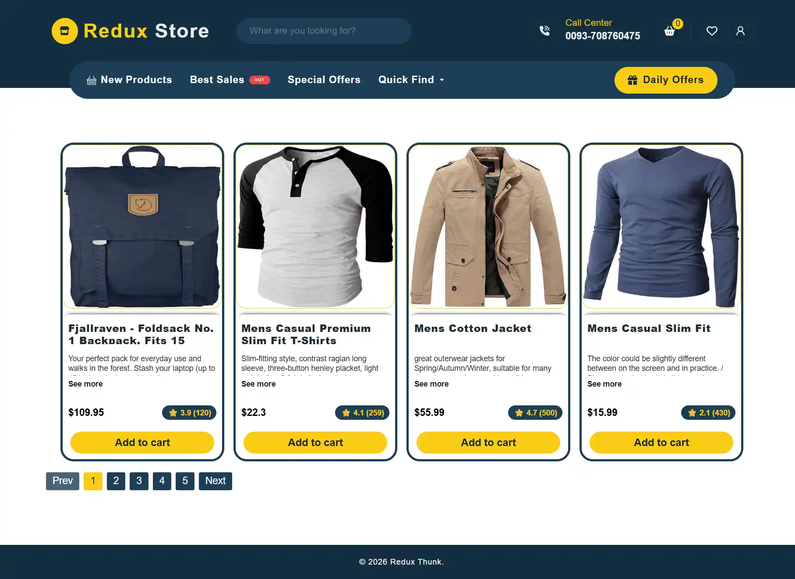
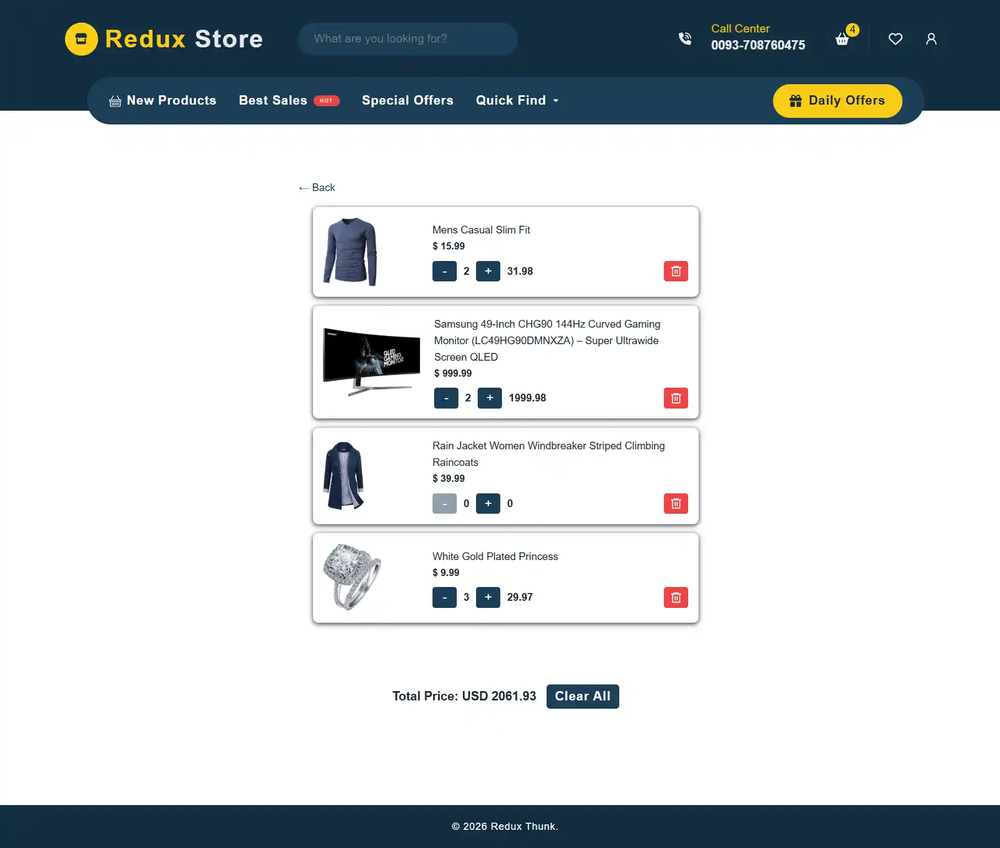

🛒 Redux Toolkit Store Project (Thunk API)

A modern React + Redux Toolkit store application built with Vite, demonstrating real-world state management using Redux Toolkit, createAsyncThunk, and a shopping cart system.
This project fetches products from an external API, allows searching and filtering, and manages a fully functional cart.

---

## 📸 Screenshot

---

## 🌏 Live Demo

[Click here to see the live demo](https://aymaq-code.github.io/Redux-Thunk-API/)

---

🚀 Features

⚛️ Built with React + Vite

🧰 State management using Redux Toolkit

🌐 Async data fetching with createAsyncThunk

🛍️ Product list fetched from Fake Store API

🔍 Search products by text

🗂️ Filter products by category

➕ Add items to cart

➖ Increase / decrease item quantity

❌ Remove items from cart

🧹 Clear entire cart

📱 Responsive UI with reusable components

🧭 Client-side routing

---

🧠 Technologies Used

React 18

Redux Toolkit

Redux Thunk (via createAsyncThunk)

Vite

JavaScript (ES6+)

CSS (modular per component)

Fake Store API
